# バズミシュラン 🍽️

**福岡のグルメ情報 × SNS体験 × Webアプリケーション**

---

## 📌 コンセプト・目的

**バズミシュラン** は、InstagramのようなSNS体験と、食べログのようなレビュー機能を簡素化して融合したWebアプリです。  
ユーザーが店舗情報・画像・コメントなどを投稿し、「バズ（いいね）」を通じて人気の店舗が可視化される仕組みになっています。

訓練校で学習した内容を、チーム開発で**アウトプットして理解を深める**ことを目的とし、習得したスキルを活かしたWebアプリとして開発しました。

### 🎯 背景

近年、SNS上にグルメ情報が氾濫する一方で、投稿主が店舗情報を記載しないことによる「再検索」の手間が発生。  
バズミシュランでは、**投稿者が店舗情報を入力**する設計とすることで、**SNSの拡散力 × 確度の高い店舗情報**の両立を実現しました。

---

## ⚙️ 使用技術

| カテゴリ       | 技術構成                          |
|----------------|------------------------------------|
| フロントエンド | JSP, HTML, CSS, JavaScript         |
| バックエンド   | Java (Servlet), JSP                |
| データベース   | PostgreSQL                         |
| データ連携     | Ajax(JSONに変換)                         |
| 開発環境       | Eclipse, Tomcat10 (Java21), GitHub |

---

## ✨ 主な機能一覧

- ユーザー登録・ログイン機能
- 投稿機能（画像＋コメント＋店舗情報）
- 画像をDBに保存・表示（bytea型）
- 投稿編集・削除（所有者チェック付き）
- バズ（いいね）機能
- 店舗ランキング表示機能
- マイページ（ユーザー情報＋投稿一覧）

---

## 📸 画面紹介（UIギャラリー）

### 🏠 トップページ
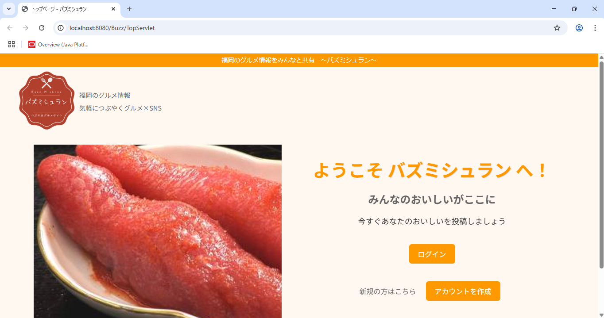

### 🔐 ログイン関連
| ログイン画面 | ユーザー登録 |
|--------------|---------------|
| 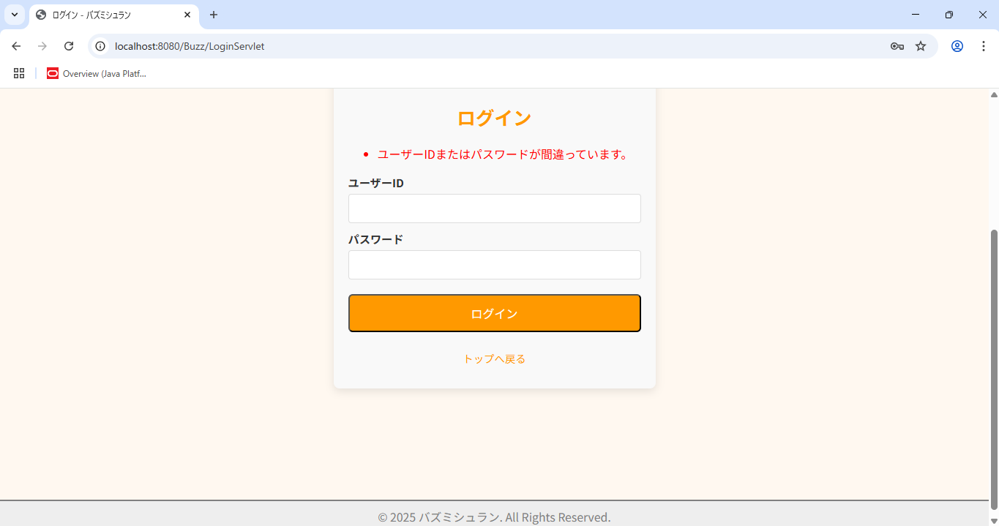 | 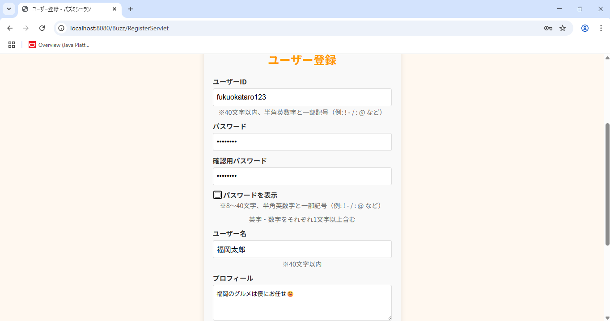 |

### 🍔 メイン・投稿・店舗選択
| メインメニュー | 投稿画面 | 店舗選択 |
|----------------|----------|-----------|
| 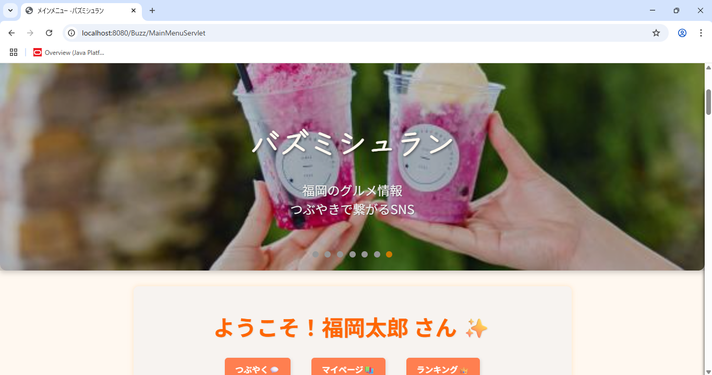 | 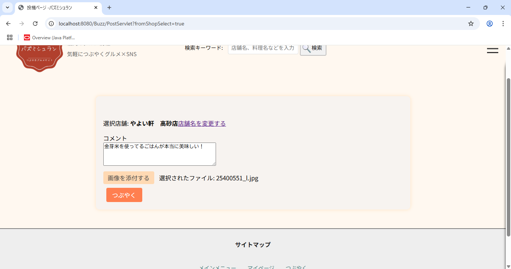 | 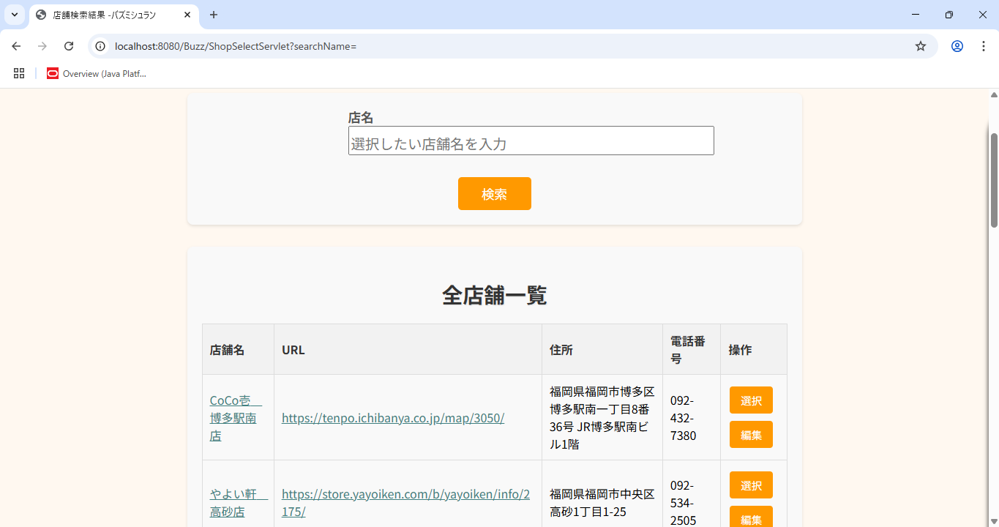 |

### ⭐ ランキング・バズ・店舗情報
| ハンバーガーメニュー | ランキング画面 | 店舗情報画面 |
|----------------------|----------------|----------------|
| 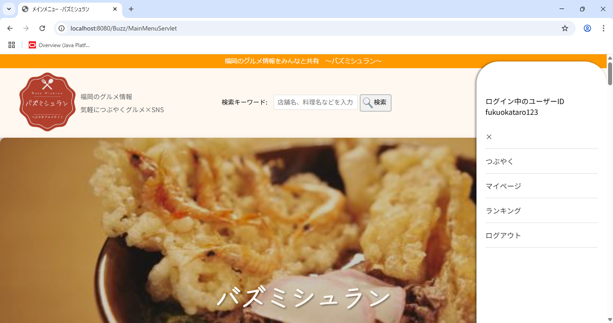 | 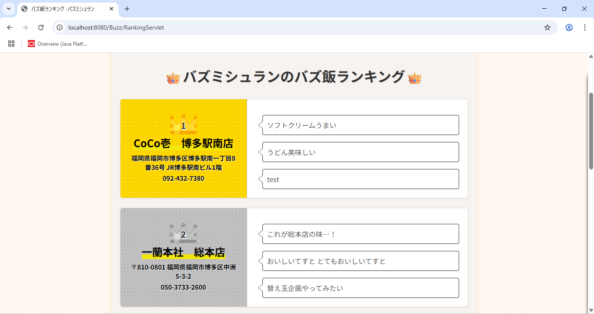 | 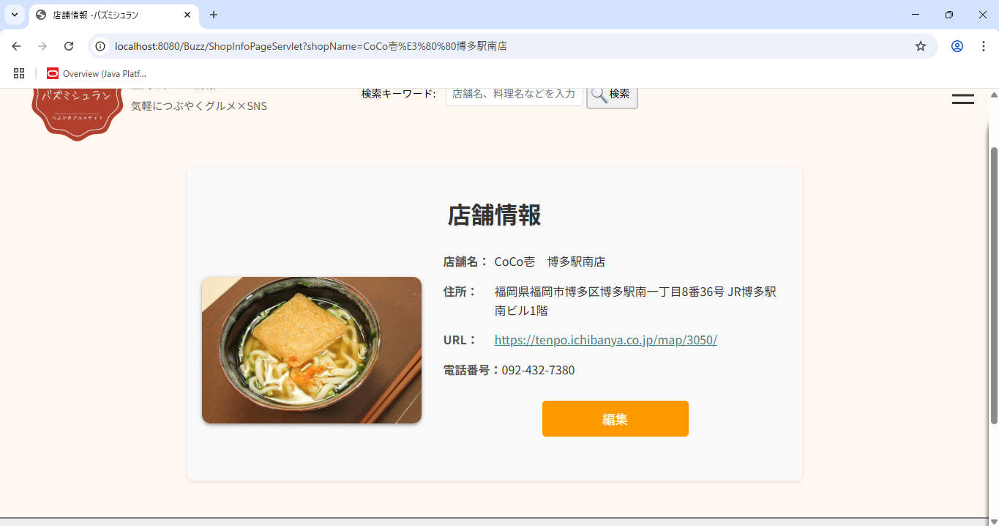 |

### 🔘つぶやき・バズボタン
| つぶやき内容 | バズボタン（押す前） | バズボタン（押した後） |
|----------------------|----------------|----------------|
| 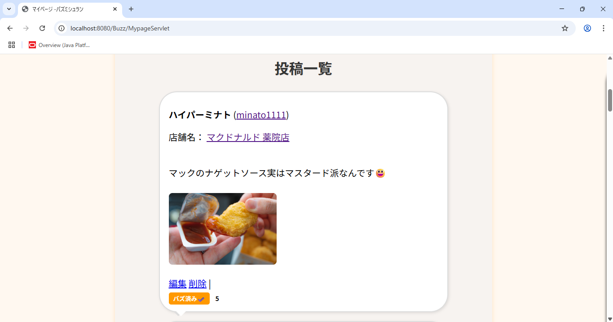 | 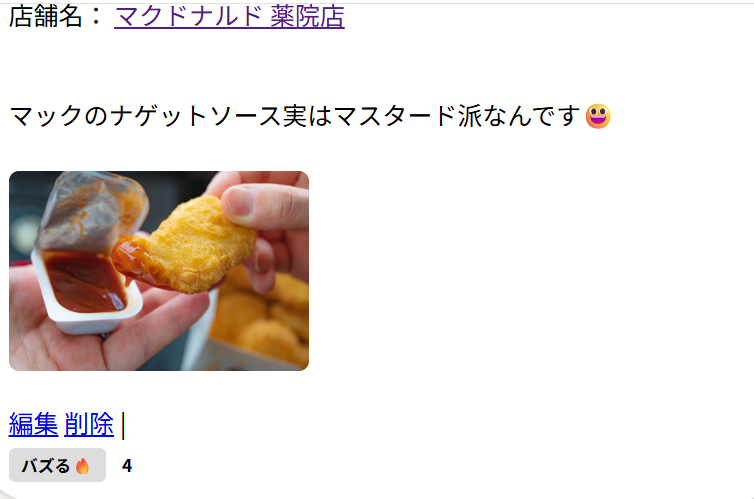 | 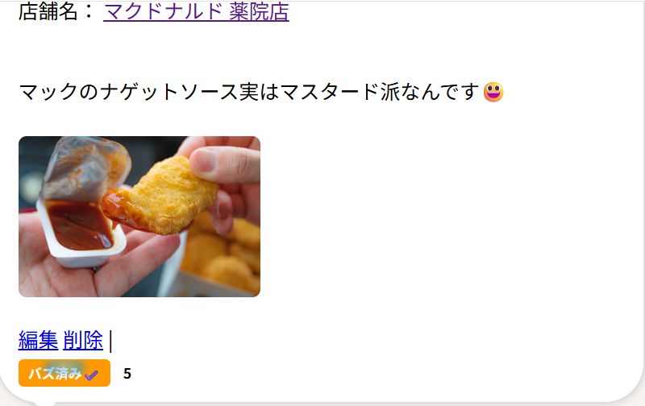 |

### 📝マイページ・ユーザーページ
| マイページ | ユーザーページ |
|----------------------|----------------|
| 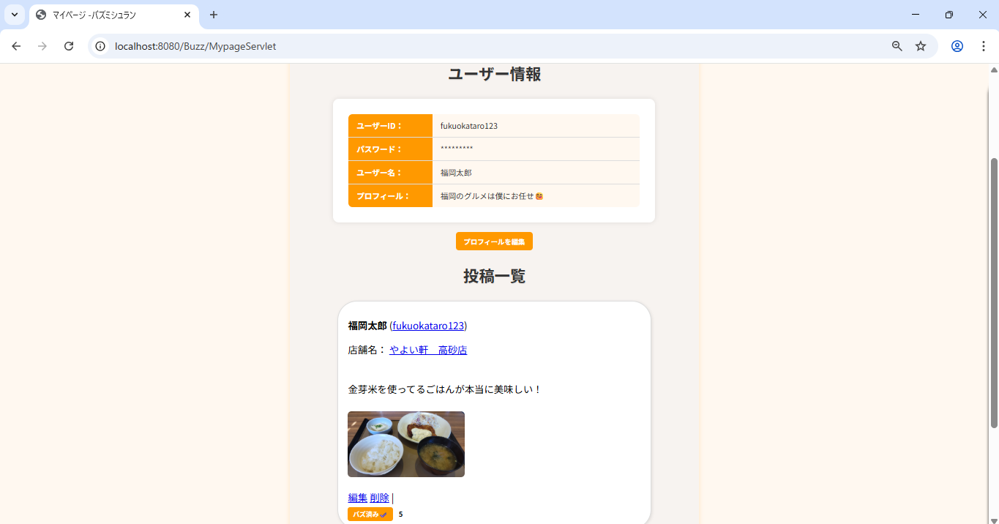 | 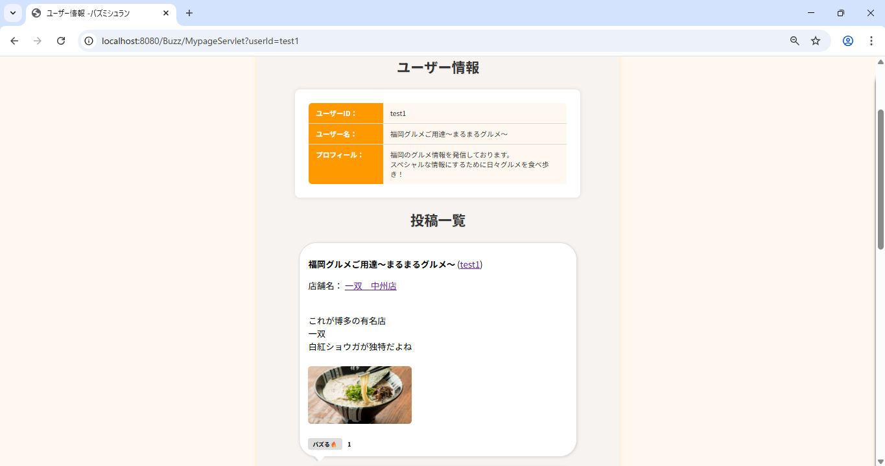 | 

---

## 🔧 工夫・こだわりポイント

- SNS的なデザインで気軽に投稿できるUI設計
- 投稿数・バズ数のランキング機能（SQL集計）
- セッションを活用した多元的な画面遷移処理
- 画像をDB（bytea型）で保存し、表示も工夫
- 投稿者のみがポストの編集・削除できるように制御

---

## 💦 苦労した点・学び

- 画像アップロード・DB保存・表示処理の構築
- JavaScriptとAjaxの連携（バズ機能の非同期処理）
- ログイン状態に応じた画面制御・表示の切り替え
- チーム開発におけるCSS統一感の維持
- SQLのJOIN・GROUP BY集計処理のバグ対応

---

## 🧑‍💻 チーム開発メンバー

| 名前   | 担当領域                                      |
|---------------|---------------------------------------|
| 高橋(リーダー) | 投稿・ランキング機能、バズ処理、DB設計   |
| 古市   　　　　| トップページ、ユーザー登録・ログイン機能 |
| 天本  　　　　 | 店舗情報の表示・検索機能、検索処理まわり  |

> ※ GitHubブランチ管理で競合が発生したため、次回以降は **個人ブランチ → プルリク形式** での運用を予定。

---

## 🏁 今後の展望

- ポストに対するコメント機能の追加
- ユーザーのフォロー機能
- タイムライン表示をフォローや関連ユーザーで制御
- スマホ対応のレスポンシブ対応
- 画像のクラウド保存（例：Firebaseなど）への移行

---

## 📂 セットアップ方法（ローカル環境）

1. EclipseでTomcat10を構成
2. PostgreSQLをセットアップ
3. DBテーブルを構築
4. プロジェクトをEclipseにインポートし、Tomcatで起動

---

## 📝 備考

このプロジェクトは**学習および転職活動のポートフォリオ**として制作されています。  
商用利用はご遠慮ください。

---
